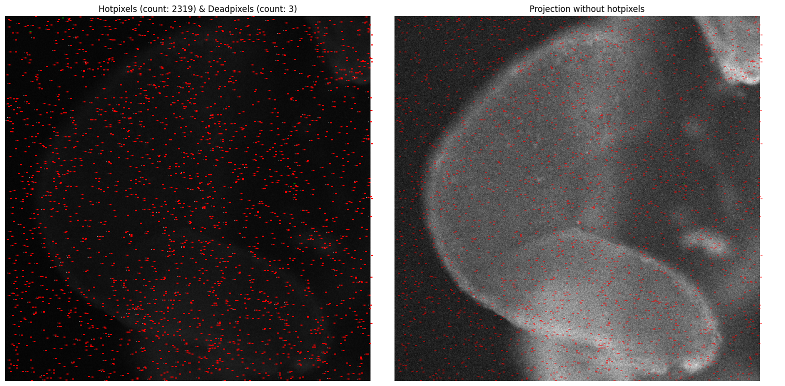

# SPAD512 data loader and preprocessor

SPADTools is a simple data loader and preprocessor for the SPAD data from the SPAD512S Photon-Counting SPAD Camera. It can load the entire SPAD data folder with optimized loading and unpacking speed (10x faster than the vendor python loader). It support lazy loading, indexing and slicing of the data. It also support dummy data generation and statistical off-board hotpixel correction.

## Installation

```bash
pip install git+https://github.com/lyehe/spadtools.git
```

## Example usage

To load a directory of files in to the memory:

```python
from spadtools import SPADFile, SPADData
dir_path = Path("path_to_data_directory")
dataset = SPADFile(data_path, load_data=True)
```

To output the entire folder as a single array:

```python
combined_data = dataset.combine()
stacked_data = dataset.combine(concat=False)
```

To access each file:

```python
data = dataset[0] # load the first file
data = dataset[0:10] # load the first 10 files into a list
```

Or your can load a single file:

```python
data_path = Path("path_to_data")
data = SPADData(data_path)
```

To preview the data:

```python
data.preview()
```

To concatenate the multiple files into a single data:

```python
data1, data2, data3 = dataset[:3]
new_data: SPADData = data1 + data2
new_data += data3
```

To extract the data as a numpy array:

```python
data_array = new_data.data
```

To generate dummy data:

```python
from spadtools import GenerateTestData, SPADHotpixelTool
dummy_data = GenerateTestData()
dummy_array = dummy_data.generate() # Gaussian noise with hot pixels
dummy_folder_with_files = dummy_data.create() # Returns path
dummy_data.remove() # Remove the dummy data
```

To correct the hot pixels:

```python
dummy_dataset = SPADFile(dummy_folder_with_files)
data_array = dummy_dataset.combine()
processing = SPADHotpixelTool(data_array)
hotpixel.inspect() # Show the hot pixels and correction result
corrected_data = hotpixel.corrected_image # Correct the hot pixels
hotpixel.reset()
hotpixel.inspect(hp_threshold=1.25, deadpixel=True, dp_threshold=3)
```

Example of output image. Zoom in for detailed views.

